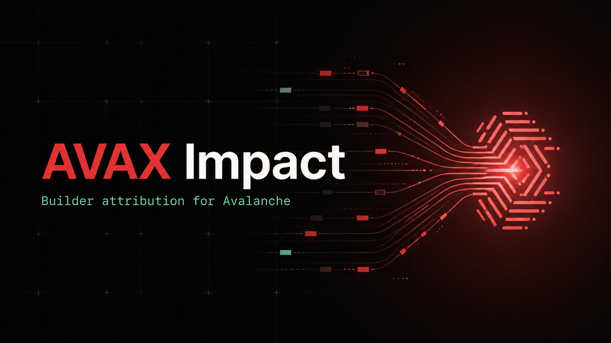

# AVAX Impact



[](https://github.com/0xArayy/avax-impact/actions/workflows/ci.yml)

Safety-first transaction attribution tooling for Avalanche C-Chain and EVM-based
Avalanche L1s, evaluated against the ERC-8021 draft.

AVAX Impact appends a compact, public builder-code declaration to transaction calldata
without changing the target function ABI. The SDK can simulate the exact attributed
call, fall back to the original calldata, fetch and decode transactions, and resolve a
registry record.

[Open the live Fuji attribution workbench](https://avax-impact.0xarayy.workers.dev).

## Standards status

ERC-8021 is not a finalized ERC. This repository pins draft commit
[`457532f5c064a4619868ee5e4950f0cc32a7917e`](https://github.com/ilikesymmetry/ERCs/blob/457532f5c064a4619868ee5e4950f0cc32a7917e/ERCS/erc-8021.md).

- The current SDK encodes and decodes the pinned schema 1 format and retains the earlier
  AVAX Impact schema 0 wire-format prototype.
- The current local `BuilderRegistry` implements the pinned `ICodeRegistry` read ABI,
  plus AVAX Impact lifecycle extensions.
- The existing Fuji deployment predates those conformance changes. It is a schema 0
  wire-format prototype backed by the legacy AVAX Impact registry ABI. It is not a
  canonical or interoperable ERC-8021 registry deployment.

This distinction is intentional: local conformance is testable now, while a new
conformant schema 1 Fuji deployment remains grant work.

## What is implemented

- TypeScript schema 0 and pinned schema 1 encoder/decoder with shared conformance vectors.
- JSON-RPC client, chain-checked transaction fetch/decode, pinned `ICodeRegistry` resolution,
  and a separate legacy Fuji registry resolver.
- Exact `eth_call` simulation with automatic fallback to original calldata.
- Local Solidity registry conforming to the pinned resolver ABI, with owner-controlled
  payout, metadata, transfer, and permanent deactivation extensions.
- Compatible and deliberately incompatible calldata demo contracts.
- Reproducible historical Fuji evidence and an automated read-only verifier.

## How it works

```text
function calldata + builder declaration + ERC-8021 marker
                              |
                       exact eth_call
                        /           \
                 compatible       rejected/error
                     |                  |
            attributed calldata   original calldata
                     |
          decoder + explicit registry lookup
```

Attribution identifies the app, wallet, bot, or backend that the transaction publicly
declares. It does not identify the protocol contract being called and does not prove
that the registered builder created or authorized the transaction.

## Quick start

Requirements: Node.js 22+, npm, and Foundry.

```bash
npm install
npm test
# Repository-wide build/test/lint/format/shell gate:
npm run check
```

Verified locally on 2026-08-27: 33 SDK tests and 18 Solidity tests pass. Demo tests are
maintained separately, run by `npm run check`, and are not included in that count.

## SDK

Legacy schema 0 prototype:

```ts
import { appendAttribution, decodeAttribution } from "@avax-impact/sdk";

const calldata = "0x1234";
const attributed = appendAttribution(calldata, ["avax-impact"]);
const decoded = decodeAttribution(attributed);
```

Pinned schema 1:

```ts
import { appendAttributionV1 } from "@avax-impact/sdk";

const attributed = appendAttributionV1("0x1234", {
  registryAddress: "0xcccccccccccccccccccccccccccccccccccccccc",
  registryChainId: 43113n,
  codes: ["avax-impact"],
});
```

See [the SDK documentation](packages/sdk/README.md) for transaction analysis, registry
resolution, CLI commands, and the safe dry-run flow. The package is not yet published
to npm; examples currently use the workspace build.

## Historical Fuji proof

Network: Avalanche Fuji C-Chain (`43113`). Builder code: `avax-impact`.

| Contract | Address |
| --- | --- |
| Legacy BuilderRegistry | [`0x8f13…549F`](https://build.avax.network/explorer/fuji/c-chain/address/0x8f13a300f2773EB6fa071B9196f6e16129F2549F) |
| AttributionDemo | [`0x4e08…7200`](https://build.avax.network/explorer/fuji/c-chain/address/0x4e0803c679Fff7F3781856b41C2A810E76c47200) |
| StrictCalldataDemo | [`0x8545…bf8E`](https://build.avax.network/explorer/fuji/c-chain/address/0x854595b7260f1325f643dd732F926c6B5da3bf8E) |

Attributed schema 0 demo transaction:
[`0x33c0…0821`](https://testnet.snowtrace.io/tx/0x33c0fb7ee4f48276dd237d67c4f8186b2416d2a033a90068d12efed63c8f0821).

The deployment source was restored at
[`0c0665124ed8f1edc5372ed48c77a92a941d08be`](https://github.com/0xArayy/avax-impact/commit/0c0665124ed8f1edc5372ed48c77a92a941d08be).
The [deployment manifest](deployments/fuji.json) records compiler settings, runtime
bytecode hashes, transactions, registry state, and verification timestamps.

Run the read-only verifier:

```bash
npm run verify:fuji
```

It rebuilds the restored source commit, compares live runtime bytecode, checks every
recorded receipt, resolves the legacy registry record, and fetches and decodes the
attributed transaction. It requires outbound access to the configured `FUJI_RPC_URL`
(or the public default) and exits nonzero on a mismatch or unavailable RPC.

## Repository layout

```text
contracts/       Registry, demo contracts, Foundry tests, deployment scripts
packages/sdk/    TypeScript library, CLI, and tests
demo/            Public attribution inspection and preflight workbench
scripts/         Fuji deployment, demo flow, and read-only verification
deployments/     Public deployment manifests
docs/            Format, operations, audit, validation, and grant material
```

## Compatibility, security, and current limits

- Extra calldata works with standard Solidity ABI decoding but is not universally safe.
  Contracts that inspect `msg.data.length` or use custom decoders may reject it.
- `prepareAttributedCall` simulates the exact payload and falls back safely, but an
  `eth_call` cannot guarantee later inclusion-state execution. Supply the real `from`
  and `value` context.
- Builder codes are public and spoofable. Never use attribution alone for
  authorization, identity proof, payments, or grant allocation.
- The contracts are unaudited, the SDK is unpublished, and no external adopters or
  interviews are documented yet.
- No conformant schema 1 / `ICodeRegistry` Fuji deployment exists yet. The listed Fuji
  registry is the legacy prototype only.

## Documentation

- [Attribution formats and trust model](docs/attribution-format.md)
- [Fuji verification and deployment runbook](docs/fuji-runbook.md)
- [Current acceptance matrix](docs/acceptance-matrix.md)
- [Technical audit](docs/technical-audit.md)
- [Grant project narrative](docs/grant-application.md)
- [Market validation plan](docs/market-validation.md)
- [Product direction](docs/product-direction.md)

## License

[MIT](LICENSE).
